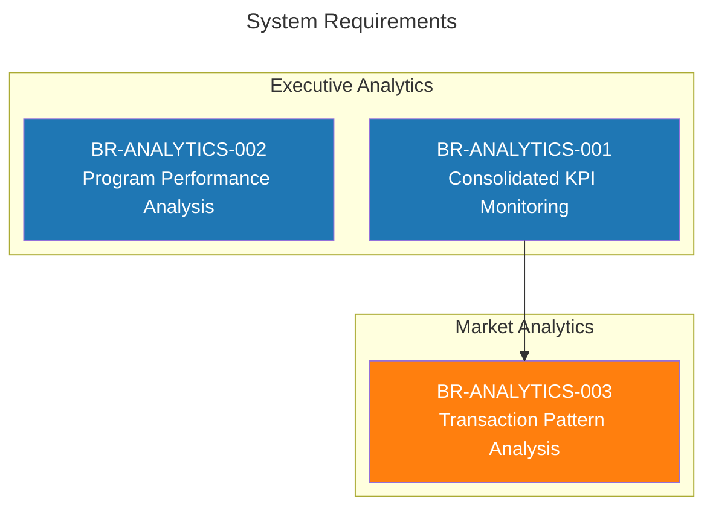
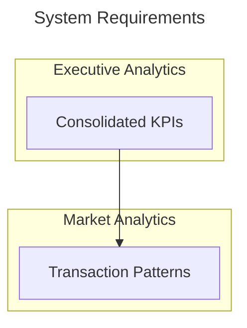

# Visualization with ArcLang

## Overview

ArcLang supports generating visualizations from your models using Mermaid diagrams. This allows you to create flowcharts, requirement diagrams, and architecture visualizations directly from your `.arc` files.

## Quick Start

```bash
# Export to ArcViz (native interactive visualization) - NEW!
arclang export model.arc -o diagram.html -f arc-viz

# Export ArcLang to Mermaid diagram
arclang export model.arc -o diagram.mmd -f mermaid

# Export ArcLang to PlantUML diagram
arclang export model.arc -o diagram.puml -f plant-uml

# Generate diagram and open in browser
arclang diagram model.arc -o diagram.mmd --open

# Import Mermaid back to ArcLang
arclang import diagram.mmd -f mermaid -o model.arc

# Import PlantUML back to ArcLang
arclang import diagram.puml -f plant-uml -o model.arc

# Export to other formats
arclang export model.arc -o model.json -f json
arclang export model.arc -o model.xml -f capella
```

---

## Supported Formats

### 1. ArcViz - Native Interactive Visualization (NEW!)

ArcLang's own visualization format - professional, interactive SVG diagrams with no external dependencies!

```bash
# Generate interactive HTML visualization
arclang export model.arc -o diagram.html -f arc-viz

# Then open in any browser - no internet connection required!
```

**Features**:
- ✅ **Native Format**: Purpose-built for systems engineering
- ✅ **Interactive**: Zoom, pan, drag with mouse
- ✅ **Self-Contained**: Single HTML file, works offline
- ✅ **Professional Design**: Clean, modern styling
- ✅ **Color-Coded**: Automatic priority-based coloring (Critical=red, High=orange)
- ✅ **Category Grouping**: Organized by requirement categories
- ✅ **Traceability Lines**: Visual dependency relationships
- ✅ **Export SVG**: Built-in SVG export button
- ✅ **Responsive**: Works on desktop, tablet, mobile

**Why ArcViz?**
- No dependency on Mermaid, PlantUML, or other tools
- Optimized for requirements traceability
- Perfect for presentations and documentation
- Clean, professional output suitable for stakeholders

---

### 2. Mermaid Flowcharts (BIDIRECTIONAL!)

Generate Mermaid flowchart diagrams showing requirements and their dependencies. **Now supports import back to ArcLang!**

### 3. PlantUML Diagrams (BIDIRECTIONAL!)

Generate PlantUML component and activity diagrams. **Full bidirectional support!**

```bash
# Export: ArcLang -> PlantUML
arclang export model.arc -o diagram.puml -f plant-uml

# Import: PlantUML -> ArcLang
arclang import diagram.puml -f plant-uml -o model.arc
```

**Supported PlantUML Diagram Types**:
- **Component Diagrams**: Packages, nodes, clouds, databases with components
- **Activity Diagrams**: Sequential process flows

**Features**:
- ✅ Export ArcLang models to PlantUML
- ✅ Import PlantUML diagrams back to ArcLang
- ✅ Preserves components, relationships, and groupings
- ✅ Supports package/node/cloud/database containers
- ✅ Activity flows convert to operational analysis

---

### Mermaid Flowcharts (Details)

Generate Mermaid flowchart diagrams showing requirements and their dependencies. **Now supports import back to ArcLang!**

```bash
# Export: ArcLang -> Mermaid
arclang export model.arc -o diagram.mmd -f mermaid

# OR use the diagram command with visual output
arclang diagram model.arc -o diagram.mmd --open

# Import: Mermaid -> ArcLang (NEW!)
arclang import diagram.mmd -f mermaid -o model.arc
```

**Features**:
- ✅ Export ArcLang models to Mermaid flowcharts
- ✅ Import Mermaid flowcharts back to ArcLang
- ✅ Preserves requirements, categories, and traceability
- ✅ Round-trip conversion (ArcLang → Mermaid → ArcLang)

**Output Format**: Mermaid flowchart syntax compatible with:
- GitHub Markdown
- GitLab Markdown  
- Mermaid Live Editor
- VS Code Mermaid extensions
- Documentation sites (MkDocs, Docusaurus, etc.)

---

## Bidirectional Conversion Workflow

ArcLang now supports full bidirectional conversion with Mermaid diagrams:

### Workflow 1: Visual Design First

1. **Create diagram visually** using Mermaid Live Editor or draw.io
2. **Import to ArcLang** for formal modeling
3. **Enhance with details** (safety levels, stakeholders, etc.)
4. **Export to other formats** (Capella, JSON, etc.)

```bash
# Start with Mermaid diagram
arclang import requirements.mmd -f mermaid -o model.arc

# Compile and validate
arclang build model.arc

# Export to Capella for detailed modeling
arclang export model.arc -o model.xml -f capella
```

### Workflow 2: Code First, Visualize Later

1. **Write ArcLang models** in your editor
2. **Export to Mermaid** for visualization
3. **Share with stakeholders** via GitHub/Confluence
4. **Update and re-import** if needed

```bash
# Start with ArcLang
arclang build model.arc

# Generate visualization
arclang diagram model.arc -o diagram.mmd --open

# If diagram is edited, re-import
arclang import diagram.mmd -f mermaid -o model_updated.arc
```

### Round-Trip Example

```bash
# Original model
arclang export pluxee_analytics.arc -o v1.mmd -f mermaid

# Import back (preserves structure)
arclang import v1.mmd -f mermaid -o reimported.arc

# Export again (identical output)
arclang export reimported.arc -o v2.mmd -f mermaid

# Verify round-trip integrity
diff v1.mmd v2.mmd  # Should be identical!
```

---

## Example: Business Requirements Diagram

### Input: ArcLang Model

```arc
system_analysis "Analytics Platform" {
    requirement "BR-ANALYTICS-001" {
        id: "ANLX001"
        description: "Consolidated KPI Monitoring"
        category: "Executive Analytics"
        priority: "Critical"
    }
    
    requirement "BR-ANALYTICS-002" {
        id: "ANLX002"
        description: "Program Performance Analysis"
        category: "Executive Analytics"
        priority: "Critical"
    }
    
    requirement "BR-ANALYTICS-003" {
        id: "ANLX003"
        description: "Transaction Pattern Analysis"
        category: "Market Analytics"
        priority: "High"
    }
}

// Dependencies
trace "ANLX001" implements "ANLX003" {
    rationale: "KPIs depend on transaction analysis"
}
```

### Output: Mermaid Diagram



---

## Real-World Example: Pluxee Analytics

See `examples/business/pluxee_analytics.arc` for a complete business requirements model with:
- **18 requirements** across 8 categories
- **9 logical components** (analytics engines)
- **18 functions** (data processing)
- **45 traceability links** (dependencies)

### Generate Visualization

```bash
# Compile the model
arclang build examples/business/pluxee_analytics.arc

# Generate Mermaid diagram
arclang export examples/business/pluxee_analytics.arc -o pluxee.mmd -f mermaid

# OR generate and open in browser
arclang diagram examples/business/pluxee_analytics.arc -o pluxee.mmd --open
```

### Categories Supported

The Mermaid generator automatically organizes requirements by category:
- Executive Analytics (blue)
- Market Analytics (orange)
- Merchant Analytics (green)
- Client Analytics (red)
- Financial Analytics (purple)
- Compliance Analytics (brown)
- Data Quality Analytics (pink)
- Advanced Analytics (gray)
- Implementation (yellow/green)

---

## How It Works

### 1. Category Detection

Requirements are grouped by their `category` attribute or inferred from ID patterns:

```arc
requirement "BR-ANALYTICS-001" {
    category: "Executive Analytics"  // Explicit category
}

requirement "ANLX001" {
    // Category inferred from ID pattern
}
```

### 2. Relationship Mapping

Traces with `implements` type become arrows in the flowchart:

```arc
trace "REQ-A" implements "REQ-B" {
    rationale: "A depends on B"
}
```

Generates: `REQ-A --> REQ-B`

### 3. Styling

Automatic color coding by category:
- Executive: Blue (#1F77B4)
- Market: Orange (#FF7F0E)
- Merchant: Green (#2CA02C)
- Client: Red (#D62728)
- Financial: Purple (#9467BD)
- And more...

---

## Advanced Usage

### Custom Layouts

Mermaid supports multiple layout engines:

```bash
# ELK layout (default - good for large graphs)
arclang export model.arc -o diagram.mmd -f mermaid

# Dagre layout (traditional top-down)
# (future: --layout dagre flag)
```

### Filtering

Show only specific categories (future feature):

```bash
# Show only executive and financial analytics
arclang export model.arc -o diagram.mmd -f mermaid \
  --categories "Executive Analytics,Financial Analytics"
```

### Multiple Diagram Types

Generate different views of the same model (future):

```bash
# Requirements flowchart
arclang export model.arc -o requirements.mmd -f mermaid-flowchart

# Component diagram
arclang export model.arc -o components.mmd -f mermaid-component

# Sequence diagram
arclang export model.arc -o sequence.mmd -f mermaid-sequence
```

---

## Integration with Documentation

### GitHub/GitLab

Embed Mermaid diagrams in README.md:

````markdown
# Project Architecture


````

### MkDocs / Docusaurus

```markdown
# Architecture

!!! note "System Requirements"
    ```mermaid
    flowchart TD
      ...
    ```
```

### Confluence / Jira

1. Generate Mermaid diagram
2. Use Mermaid plugin for Confluence
3. Paste generated code

---

## Limitations & Future Work

### Current Capabilities ✓

1. **ArcViz Native Format**: ✓ Interactive SVG/HTML visualizations (NEW!)
2. **Mermaid Export**: ✓ Direct export to Mermaid format
3. **Mermaid Import**: ✓ Import Mermaid diagrams back to ArcLang
4. **PlantUML Export**: ✓ Export to PlantUML component/activity diagrams
5. **PlantUML Import**: ✓ Import PlantUML diagrams back to ArcLang
6. **Round-Trip Conversion**: ✓ Both Mermaid and PlantUML preserve data
7. **Category Grouping**: ✓ Automatic organization by requirement category
8. **Interactive Features**: ✓ Zoom, pan, drag in ArcViz
9. **Visual Browser**: ✓ HTML viewer with --open flag
10. **Traceability**: ✓ Shows requirement dependencies and relationships

### Current Limitations

1. **Diagram Types**: Only flowcharts supported (no sequence, class diagrams yet)
2. **Customization**: Limited color/style customization beyond categories
3. **Large Graphs**: Very large models (100+ requirements) may be hard to read
4. **Layout Options**: Only ELK layout currently supported

### Future Enhancements

- [x] Direct Mermaid export command
- [x] Mermaid import (bidirectional conversion)
- [x] PlantUML export (component & activity diagrams)
- [x] PlantUML import (bidirectional conversion)
- [x] Interactive HTML output
- [ ] Import from GitHub/GitLab Mermaid blocks
- [ ] PlantUML sequence diagrams
- [ ] PlantUML class diagrams
- [ ] Multiple diagram types (ER, state, deployment)
- [ ] Custom color schemes and themes
- [ ] Multiple layout engines (dagre, klay, d3)
- [ ] Filtering by category or element type
- [ ] Visual diagram editor integration
- [ ] D3.js visualizations
- [ ] SVG export
- [ ] Graphviz DOT format (bidirectional)
- [ ] Draw.io XML export/import

---

## Example Gallery

### Simple Requirement Flowchart

```arc
system_analysis "Payment System" {
    requirement "REQ-001" {
        id: "PAY-001"
        description: "Process payments"
        category: "Core"
    }
    
    requirement "REQ-002" {
        id: "PAY-002"
        description: "Validate cards"
        category: "Security"
    }
}

trace "PAY-001" implements "PAY-002" {
    rationale: "Payment processing requires card validation"
}
```

### Component Architecture

```arc
logical_architecture "System" {
    component "Frontend" {
        id: "LC-001"
        type: "Logical"
    }
    
    component "Backend API" {
        id: "LC-002"
        type: "Logical"
    }
    
    component "Database" {
        id: "LC-003"
        type: "Logical"
    }
}

trace "LC-001" implements "LC-002" {
    rationale: "Frontend calls Backend API"
}

trace "LC-002" implements "LC-003" {
    rationale: "Backend stores data in Database"
}
```

### Traceability Matrix

```arc
requirement "SYS-001" {
    id: "SYS-001"
    description: "System shall be reliable"
}

component "Controller" {
    id: "LC-001"
    type: "Logical"
}

trace "LC-001" satisfies "SYS-001" {
    rationale: "Controller implements reliability mechanisms"
}
```

---

## Best Practices

### 1. Use Clear IDs

```arc
// Good: Descriptive IDs
requirement "BR-ANALYTICS-001" {
    id: "ANLX001"
}

// Avoid: Generic IDs
requirement "REQ-1" {
    id: "R1"
}
```

### 2. Add Categories

```arc
// Explicit categories help with grouping
requirement "Payment Processing" {
    category: "Core Functionality"
}
```

### 3. Document Dependencies

```arc
// Use rationale to explain why dependencies exist
trace "A" implements "B" {
    rationale: "Detailed explanation of dependency"
}
```

### 4. Keep Diagrams Focused

For large models, create multiple views:
- Executive view: High-level requirements only
- Technical view: Components and functions
- Traceability view: Requirements to components

---

## Tools & Resources

### Mermaid Tools

- **Mermaid Live Editor**: https://mermaid.live
- **VS Code Extension**: mermaid-markdown-syntax-highlighting
- **GitHub**: Native Mermaid support in Markdown
- **GitLab**: Native Mermaid support

### ArcLang Visualization

- **Capella Integration**: Export to Capella for graphical editing
- **JSON Export**: Use JSON for custom visualizations
- **Markdown Export**: Generate documentation with diagrams

---

## Conclusion

ArcLang provides multiple paths to visualization:

1. **Text-based**: Mermaid diagrams in Markdown
2. **Graphical**: Export to Capella for GUI editing
3. **Programmatic**: JSON export for custom tools
4. **Documentation**: Integrated with docs platforms

Choose the approach that fits your workflow!

---

**See also:**
- [BIDIRECTIONAL_CONVERSION.md](BIDIRECTIONAL_CONVERSION.md) - Capella integration
- [examples/business/pluxee_analytics.arc](examples/business/pluxee_analytics.arc) - Complete example
- [Mermaid Documentation](https://mermaid.js.org)
