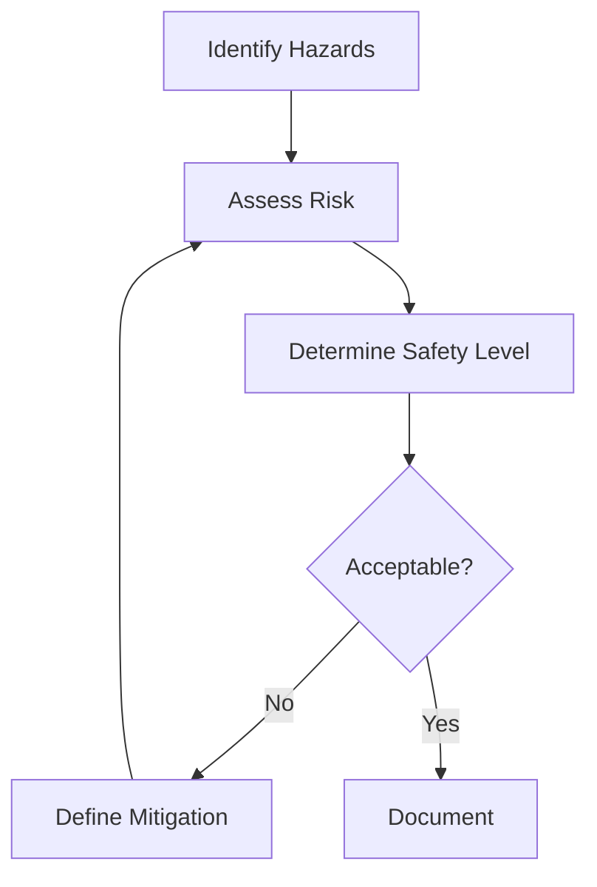

# 🛡️ Safety Standards Guide

**Complete guide for safety-critical systems development with ArcLang**

---

## Table of Contents

1. [Introduction](#introduction)
2. [ISO 26262 (Automotive)](#iso-26262-automotive)
3. [DO-178C (Aerospace)](#do-178c-aerospace)
4. [IEC 61508 (Industrial)](#iec-61508-industrial)
5. [Safety Workflow](#safety-workflow)
6. [Documentation & Certification](#documentation--certification)
7. [Tools & Automation](#tools--automation)
8. [Best Practices](#best-practices)

---

## Introduction

ArcLang provides first-class support for safety-critical systems development following three major standards:

| Standard | Domain | Safety Levels | Focus |
|----------|--------|---------------|-------|
| **ISO 26262** | Automotive | ASIL QM-D | Functional safety in road vehicles |
| **DO-178C** | Aerospace | DAL A-E | Software in airborne systems |
| **IEC 61508** | Industrial | SIL 1-4 | Functional safety of E/E/PE systems |

### Why Safety Standards Matter

- **Legal compliance**: Required for product certification
- **Risk reduction**: Systematic hazard analysis and mitigation
- **Quality assurance**: Rigorous verification and validation
- **Traceability**: Complete requirements-to-code chain
- **Documentation**: Evidence for certification authorities

---

## ISO 26262 (Automotive)

### Overview

**ISO 26262** - "Road vehicles – Functional safety"
- **Purpose**: Ensure automotive electrical/electronic systems are safe
- **Scope**: Safety lifecycle from concept to decommissioning
- **Core**: ASIL (Automotive Safety Integrity Level) classification

### ASIL Levels

| ASIL | Severity | Probability | Requirements | Example |
|------|----------|-------------|--------------|---------|
| **QM** | None | N/A | Quality Management only | Entertainment system |
| **A** | Low | Low | Basic safety measures | Windshield wipers |
| **B** | Medium | Medium | Moderate safety requirements | Turn signals |
| **C** | High | High | Stringent safety requirements | ABS braking |
| **D** | Highest | Highest | Maximum safety requirements | Steering control |

### HARA (Hazard Analysis and Risk Assessment)

**Process**: Identify hazards and determine ASIL levels

```arc
hazard "HAZ-ACC-001" {
    description: "Unintended acceleration during cruise control"
    
    // HARA Parameters
    severity: "S3"              // S0 (no injury) to S3 (life-threatening)
    exposure: "E4"              // E0 (incredible) to E4 (high probability)
    controllability: "C2"       // C0 (controllable) to C3 (uncontrollable)
    
    // Resulting ASIL (from lookup table)
    asil: "ASIL_C"             // QM, A, B, C, or D
    
    // Safety Goal
    safety_goal: "Prevent unintended acceleration in all scenarios"
    
    // Mitigation Requirements
    mitigation: ["REQ-SAFE-001", "REQ-SAFE-002"]
}
```

**ASIL Determination Table**:
```
Exposure E4 + Severity S3:
  C0 → ASIL D
  C1 → ASIL D  
  C2 → ASIL C  ← Our case
  C3 → ASIL B
```

### Requirements with ASIL

```arc
system_analysis "ACC Safety Requirements" {
    requirement "REQ-SAFE-001" {
        description: "Detect brake pedal override within 50ms"
        
        // ISO 26262 attributes
        safety_level: "ASIL_C"          // or use 'asil'
        asil: "ASIL_C"                  // Alternative syntax
        
        // Requirement classification
        type: "Safety"
        priority: "Critical"
        
        // Verification
        verification_method: "Test"
        test_coverage: "100%"           // Required for ASIL C
        
        // Documentation
        rationale: "Driver must be able to override at all times"
        failure_effect: "Unintended acceleration"
    }
    
    requirement "REQ-SAFE-002" {
        description: "Disable ACC if brake override fails"
        asil: "ASIL_C"
        type: "Safety"
        
        // Decomposition (ASIL D → C+C or D+QM)
        derived_from: ["REQ-PARENT-ASIL-D"]
        decomposition: "C"              // This is one of two ASIL C requirements
    }
}
```

### Safety Architecture

```arc
logical_architecture "ACC Safety Architecture" {
    component "Primary Controller" {
        id: "LC-PRIMARY"
        safety_level: "ASIL_C"
        
        // Freedom from interference
        memory_protection: "MPU"
        timing_protection: "Watchdog"
        
        function "Monitor Brake" {
            id: "LF-BRAKE-MON"
            safety_level: "ASIL_C"
            execution_time: "10ms"       // Must be deterministic
            wcet: "15ms"                 // Worst Case Execution Time
        }
    }
    
    // Safety mechanism (ASIL D monitoring ASIL C)
    component "Safety Monitor" {
        id: "LC-MONITOR"
        safety_level: "ASIL_D"
        independence: "Physical"         // Independent hardware
        
        function "Supervise Primary" {
            id: "LF-SUPERVISE"
            monitoring: "LC-PRIMARY"
            reaction_time: "50ms"
        }
    }
}
```

### FMEA (Failure Mode and Effects Analysis)

```arc
fmea "FMEA-SENSOR-001" {
    component: "LC-RADAR"
    function: "LF-MEASURE"
    failure_mode: "Stuck sensor reading"
    
    // Effects
    local_effect: "Incorrect distance measurement"
    system_effect: "Wrong speed control"
    end_effect: "Possible collision"
    
    // Causes
    causes: [
        "Sensor hardware failure",
        "Signal processing fault",
        "Power supply issue"
    ]
    
    // Risk Assessment (1-10 scale)
    severity: 9                 // S: Severity of effect
    occurrence: 3               // O: Probability of occurrence  
    detection: 6                // D: Ability to detect
    rpn: 162                    // RPN = S × O × D
    
    // Actions (RPN > 100 requires action)
    current_controls: "Plausibility check"
    recommended_actions: [
        "Add redundant sensor",
        "Implement sensor diagnostic",
        "Add fail-safe behavior"
    ]
    
    // After mitigation
    residual_severity: 9
    residual_occurrence: 1
    residual_detection: 3
    residual_rpn: 27            // Target: < 100
    
    // Assignment
    responsible: "Safety Team"
    target_date: "2025-12-31"
    status: "Open"
}
```

### Safety Case

```arc
safety_case "ACC Safety Case" {
    claim: "ACC system is safe for ASIL C operation"
    
    evidence: [
        "HARA completed (HAZ-ACC-001)",
        "Safety requirements defined (REQ-SAFE-*)",
        "FMEA performed (FMEA-*)",
        "Architecture reviewed",
        "Safety mechanisms implemented",
        "Test coverage 100%",
        "Independent review completed"
    ]
    
    assumptions: [
        "Driver is attentive",
        "Sensors are properly calibrated",
        "Vehicle meets ISO 26262 Part 10"
    ]
}
```

---

## DO-178C (Aerospace)

### Overview

**DO-178C** - "Software Considerations in Airborne Systems and Equipment Certification"
- **Purpose**: Software development for aviation safety
- **Scope**: Software lifecycle for airborne systems
- **Core**: DAL (Design Assurance Level) classification

### DAL Levels

| DAL | Failure Condition | Effect | Requirements | Example |
|-----|-------------------|--------|--------------|---------|
| **A** | Catastrophic | Prevents safe flight/landing | Most stringent | Primary flight control |
| **B** | Hazardous | Significant injury/workload | Very stringent | Engine control |
| **C** | Major | Discomfort, some injuries | Stringent | Navigation systems |
| **D** | Minor | Slight inconvenience | Moderate | Cabin lighting |
| **E** | No Effect | No safety impact | Minimal | Entertainment |

### Requirements with DAL

```arc
system_analysis "Flight Control Requirements" {
    requirement "REQ-FC-001" {
        description: "Maintain stable pitch control under all conditions"
        
        // DO-178C attributes
        dal: "DAL_A"                    // Design Assurance Level
        criticality: "Critical"         // Critical, High, Medium, Low
        
        // Safety analysis
        failure_condition: "Catastrophic"
        failure_probability: "< 1E-9 per flight hour"
        
        // Verification (DO-178C Table A-1)
        reviews_required: [
            "Requirements Review",
            "Design Review",  
            "Code Review",
            "Test Review"
        ]
        
        test_coverage: [
            "Statement coverage: 100%",      // Required for DAL A
            "Decision coverage: 100%",       // Required for DAL A
            "MC/DC coverage: 100%"          // Required for DAL A
        ]
        
        verification_method: "Test"
        independence: "Required"        // Independent V&V for DAL A
    }
    
    requirement "REQ-FC-002" {
        description: "Display altitude within ±50ft accuracy"
        dal: "DAL_C"                   // Less critical
        
        test_coverage: [
            "Statement coverage: 100%",      // Required for DAL C
            "Decision coverage: 100%"        // Required for DAL C
            // MC/DC not required for DAL C
        ]
    }
}
```

### Software Lifecycle (DO-178C Process)

```arc
software_lifecycle "Flight Control Software" {
    // Planning
    planning: {
        psac: "Plan for Software Aspects of Certification"
        sdp: "Software Development Plan"
        svp: "Software Verification Plan"
        scmp: "Software Configuration Management Plan"
        sqap: "Software Quality Assurance Plan"
    }
    
    // Development
    development: {
        requirements: "SRD (Software Requirements Data)"
        design: "SDD (Software Design Description)"
        code: "Source Code"
        integration: "Executable Object Code"
    }
    
    // Verification
    verification: {
        reviews: "All lifecycle data reviewed"
        testing: "Requirements-based testing"
        analysis: "Structural coverage analysis"
        traceability: "Complete requirements trace"
    }
    
    // Outputs
    outputs: [
        "Software Accomplishment Summary (SAS)",
        "Software Configuration Index (SCI)",
        "Software Life Cycle Environment Configuration Index (SECI)",
        "Problem Reports (PR)",
        "Software Configuration Management Records (SCMR)",
        "Software Quality Assurance Records (SQAR)",
        "Software Verification Results (SVR)"
    ]
}
```

### Partitioning (DO-178C / DO-297)

```arc
physical_architecture "Avionics Platform" {
    node "Integrated Modular Avionics (IMA)" {
        id: "PN-IMA"
        processor: "PowerPC"
        os: "VxWorks 653"              // ARINC 653 partitioned OS
        
        // DAL A partition (most critical)
        partition "Flight Control" {
            id: "PART-FC"
            dal: "DAL_A"
            memory: "4MB"
            time_slots: "100ms per 500ms window"
            
            // Spatial partitioning
            memory_protection: "MMU"
            
            // Temporal partitioning  
            time_protection: "ARINC 653 scheduler"
            
            deploys: ["LC-PITCH-CTRL", "LC-ROLL-CTRL"]
        }
        
        // DAL C partition (less critical)
        partition "Navigation" {
            id: "PART-NAV"
            dal: "DAL_C"
            memory: "2MB"
            time_slots: "50ms per 500ms window"
            
            deploys: ["LC-GPS", "LC-INS"]
        }
        
        // Inter-partition communication
        channel "FC_to_NAV" {
            from: "PART-FC"
            to: "PART-NAV"
            protocol: "ARINC 653 Sampling Port"
            max_message_size: "256 bytes"
            refresh_rate: "50ms"
        }
    }
}
```

### DO-178C Test Coverage

```arc
verification "Flight Control Tests" {
    component: "LC-PITCH-CTRL"
    dal: "DAL_A"
    
    // Structural coverage (DO-178C Table A-7)
    structural_coverage: {
        statement: "100%"               // Required: DAL A,B,C
        decision: "100%"                // Required: DAL A,B,C
        mcdc: "100%"                    // Required: DAL A,B (MC/DC = Modified Condition/Decision Coverage)
    }
    
    // Requirements-based testing
    requirements_tests: {
        normal: "TC-001 to TC-050"     // Normal operating conditions
        abnormal: "TC-051 to TC-075"   // Abnormal conditions
        robustness: "TC-076 to TC-100" // Robustness (DAL A,B)
    }
    
    // Test independence
    test_execution: "Independent test team"
    test_review: "Independent reviewer"
}
```

---

## IEC 61508 (Industrial)

### Overview

**IEC 61508** - "Functional Safety of Electrical/Electronic/Programmable Electronic Safety-related Systems"
- **Purpose**: Generic functional safety standard
- **Scope**: All industries (process, manufacturing, etc.)
- **Core**: SIL (Safety Integrity Level) classification

### SIL Levels

| SIL | Risk Reduction | Failure Probability | Application |
|-----|----------------|---------------------|-------------|
| **4** | 10,000 to 100,000 | 10⁻⁹ to 10⁻⁸/hour | Nuclear, high-risk chemical |
| **3** | 1,000 to 10,000 | 10⁻⁸ to 10⁻⁷/hour | Emergency shutdown systems |
| **2** | 100 to 1,000 | 10⁻⁷ to 10⁻⁶/hour | Fire detection, alarms |
| **1** | 10 to 100 | 10⁻⁶ to 10⁻⁵/hour | Non-critical monitoring |

### Requirements with SIL

```arc
system_analysis "Process Control Safety" {
    requirement "REQ-ESD-001" {
        description: "Emergency shutdown within 2 seconds"
        
        // IEC 61508 attributes
        sil: "SIL_3"                   // Safety Integrity Level
        
        // Safety function
        function_type: "Safety Instrumented Function (SIF)"
        operation_mode: "Low demand"    // <1 demand per year
        
        // Reliability
        pfd: "1E-4"                    // Probability of Failure on Demand
        proof_test_interval: "1 year"
        
        // Architecture
        architecture: "1oo2"           // 1 out of 2 (voting)
        diagnostic_coverage: "90%"
        
        verification_method: "Test"
        independence: "Required"
    }
}
```

### SIS (Safety Instrumented System)

```arc
logical_architecture "Emergency Shutdown System" {
    // Sensor (input)
    component "Pressure Sensor" {
        id: "LC-PRESS-A"
        sil: "SIL_3"
        
        // Redundancy for SIL 3
        redundancy: "Dual"
        voting: "1oo2"                 // 1 out of 2
        
        function "Measure Pressure" {
            id: "LF-PRESS"
            safe_failure_fraction: "95%"
            dangerous_failure_rate: "1E-7 per hour"
        }
    }
    
    // Logic solver
    component "Safety PLC" {
        id: "LC-LOGIC"
        sil: "SIL_3"
        certification: "TÜV SIL 3 certified"
        
        function "Evaluate Trip Condition" {
            id: "LF-TRIP"
            response_time: "100ms"
            safe_state: "De-energize to trip"
        }
    }
    
    // Final element (output)
    component "Shutdown Valve" {
        id: "LC-VALVE"
        sil: "SIL_3"
        
        fail_safe: "Fail closed"
        proof_test: "Annual"
        
        function "Close Valve" {
            id: "LF-CLOSE"
            actuation_time: "500ms"
        }
    }
}
```

### SIL Verification (IEC 61508-2)

```arc
sil_verification "ESD System Verification" {
    system: "Emergency Shutdown"
    target_sil: "SIL_3"
    
    // Hardware Safety Integrity
    hardware: {
        architecture: "1oo2"
        sff: "95%"                     // Safe Failure Fraction
        hft: 1                         // Hardware Fault Tolerance
        pfd_avg: "5E-5"                // Average PFD (target: <1E-4 for SIL 3)
    }
    
    // Software Safety Integrity  
    software: {
        development_standard: "IEC 61508-3"
        language: "Structured Text (IEC 61131-3)"
        
        techniques: [
            "Modular design",
            "Defensive programming",
            "Diverse redundancy",
            "Error detection and handling"
        ]
        
        testing: {
            functional: "100%"
            structural: "Statement 100%, Branch 100%"
        }
    }
    
    // Systematic Capability
    systematic: {
        process_quality: "IEC 61508 compliant"
        tool_qualification: "T3 tools qualified"
        competence: "Engineers certified"
    }
}
```

---

## Safety Workflow

### 1. Hazard Analysis



**In ArcLang**:

```arc
// Step 1: Identify hazard
hazard "HAZ-001" {
    description: "Loss of braking"
    causes: ["Brake actuator failure", "Controller fault"]
}

// Step 2: Assess risk
hazard "HAZ-001" {
    severity: "S3"
    exposure: "E4"
    controllability: "C2"
    asil: "ASIL_C"
}

// Step 3: Define safety requirements
requirement "REQ-SAFE-001" {
    description: "Detect brake failure within 100ms"
    asil: "ASIL_C"
}

// Step 4: Trace mitigation
trace "REQ-SAFE-001" mitigates "HAZ-001" {
    rationale: "Early detection enables safe reaction"
}
```

### 2. Safety Requirements Definition

```arc
system_analysis "Safety Requirements" {
    // Functional safety requirement
    requirement "REQ-FS-001" {
        description: "Detect and handle sensor failures"
        type: "Safety"
        safety_level: "ASIL_C"
        
        // Safety mechanisms
        mechanisms: [
            "Range check",
            "Plausibility check",
            "Redundancy check"
        ]
    }
    
    // Technical safety requirement
    requirement "REQ-TS-001" {
        description: "Implement watchdog monitoring"
        type: "Technical Safety"
        derived_from: ["REQ-FS-001"]
        
        // Implementation detail
        watchdog_timeout: "100ms"
        recovery_action: "Safe state"
    }
}
```

### 3. Safety Architecture

```arc
logical_architecture "Safety Architecture" {
    // Primary function (ASIL C)
    component "Primary Controller" {
        id: "LC-PRIMARY"
        asil: "ASIL_C"
    }
    
    // Monitor function (ASIL C)
    component "Safety Monitor" {
        id: "LC-MONITOR"
        asil: "ASIL_C"
        
        // Independence from primary
        independence: "Physical"
        diverse_technology: "Different microcontroller"
        
        function "Monitor Primary" {
            id: "LF-MON"
            monitoring: "LC-PRIMARY"
            fault_detection_time: "50ms"
        }
    }
    
    // Safe state handler
    component "Safe State Manager" {
        id: "LC-SAFE-STATE"
        asil: "ASIL_D"
        
        function "Enter Safe State" {
            id: "LF-SAFE"
            transition_time: "100ms"
            safe_action: "Disable outputs, notify driver"
        }
    }
}
```

### 4. Verification & Validation

```arc
verification_plan "Safety Verification" {
    // Requirements verification
    requirements: {
        review: "Independent review of all safety requirements"
        traceability: "100% trace from hazards to tests"
        completeness: "All ASIL C requirements covered"
    }
    
    // Design verification
    design: {
        review: "FMEA on all safety-critical components"
        analysis: "FTA for all hazards"
        independence: "Design verified by independent team"
    }
    
    // Code verification
    code: {
        review: "Line-by-line code review"
        static_analysis: "MISRA C compliance"
        coverage: "100% statement, decision, MC/DC"
    }
    
    // Integration testing
    integration: {
        normal: "All normal scenarios tested"
        fault: "All fault injection tests passed"
        boundary: "All boundary conditions tested"
    }
    
    // Validation
    validation: {
        system_test: "Complete system test in target environment"
        field_test: "Validation in real vehicle/aircraft/plant"
    }
}
```

---

## Documentation & Certification

### Required Documents (ISO 26262)

```arc
documentation "ISO 26262 Package" {
    // Management
    safety_plan: "Overall safety management plan"
    
    // Development
    safety_concept: {
        file: "Safety Concept Document"
        contains: ["Hazards", "Safety goals", "FSC"]
    }
    
    technical_safety_concept: {
        file: "Technical Safety Concept"
        contains: ["Safety requirements", "Safety mechanisms"]
    }
    
    // Verification
    verification_report: {
        file: "Verification Report"
        contains: ["Test results", "Review records", "Coverage"]
    }
    
    // Approval
    safety_case: {
        file: "Safety Case"
        contains: ["Argument", "Evidence", "Compliance matrix"]
    }
}
```

### Required Documents (DO-178C)

```arc
documentation "DO-178C Package" {
    // Plans
    psac: "Plan for Software Aspects of Certification"
    sdp: "Software Development Plan"
    svp: "Software Verification Plan"
    scmp: "Software Configuration Management Plan"
    sqap: "Software Quality Assurance Plan"
    
    // Development
    srs: "Software Requirements Standards"
    sds: "Software Design Standards"
    scs: "Software Code Standards"
    
    // Data
    srd: "Software Requirements Data"
    sdd: "Software Design Description"
    source_code: "Source Code Listings"
    eoc: "Executable Object Code"
    
    // Verification
    test_cases: "Requirements-Based Test Cases"
    test_procedures: "Test Procedures"
    test_results: "Test Results"
    coverage_analysis: "Structural Coverage Analysis"
    
    // Summary
    sas: "Software Accomplishment Summary"
}
```

### Compliance Matrix

```arc
compliance_matrix "ISO 26262 Compliance" {
    part_3: {
        clause_7: {
            requirement: "Hazard analysis and risk assessment"
            evidence: ["HAZ-001", "HARA-Report.pdf"]
            status: "Complete"
        }
        
        clause_8: {
            requirement: "Functional safety concept"
            evidence: ["FSC-Document.pdf", "REQ-SAFE-*"]
            status: "Complete"
        }
    }
    
    part_6: {
        clause_7: {
            requirement: "Software safety requirements"
            evidence: ["REQ-FS-*", "SRS-Document.pdf"]
            status: "Complete"
        }
        
        clause_9: {
            requirement: "Software unit testing"
            evidence: ["Test-Report.pdf", "Coverage-100%.html"]
            status: "Complete"
        }
    }
}
```

---

## Tools & Automation

### ArcLang Safety Commands

```bash
# Generate safety documentation
arclang safety model.arc --standard iso26262 --report

# Validate traceability
arclang trace model.arc --validate --safety-requirements

# Generate FMEA report
arclang safety model.arc --fmea --output fmea_report.html

# Generate compliance matrix
arclang safety model.arc --compliance --standard iso26262

# Export safety case
arclang export model.arc --safety-case --format pdf
```

### Integration with Safety Tools

```arc
tool_integration "Safety Tools" {
    // FMEA tools
    fmea_tool: "Relyence FMEA"
    fmea_export: "CSV format"
    
    // Testing tools
    test_automation: "Vector CANoe"
    test_management: "Polarion"
    
    // Static analysis
    static_analysis: "LDRA Testbed"
    compliance: "MISRA C 2012"
    
    // Requirements management
    requirements_tool: "IBM DOORS"
    trace_export: "ReqIF format"
}
```

---

## Best Practices

### 1. Safety Requirements

```arc
// ✅ Good: Specific, measurable, traceable
requirement "REQ-SAFE-001" {
    description: "Detect brake pedal position mismatch within 50ms"
    asil: "ASIL_C"
    verification_method: "Test"
    test_case: "TC-BRAKE-001"
}

// ❌ Bad: Vague, not measurable
requirement "REQ-SAFE-BAD" {
    description: "System should be safe"
}
```

### 2. ASIL Decomposition

```arc
// ASIL D requirement decomposed to two ASIL C
requirement "REQ-PARENT-D" {
    description: "Critical safety function"
    asil: "ASIL_D"
}

requirement "REQ-CHILD-C1" {
    description: "Primary path"
    asil: "ASIL_C"
    derived_from: ["REQ-PARENT-D"]
    decomposition: "C(C)"              // Part 1 of D→C+C
}

requirement "REQ-CHILD-C2" {
    description: "Monitoring path"
    asil: "ASIL_C"
    derived_from: ["REQ-PARENT-D"]
    decomposition: "C(C)"              // Part 2 of D→C+C
    independence: "Required"           // Must be independent
}
```

### 3. Complete Traceability

```arc
// Hazard → Safety Goal → Requirement → Component → Test

hazard "HAZ-001" { ... }

requirement "REQ-SAFE-001" { 
    mitigates: "HAZ-001"
}

component "LC-001" { ... }

trace "LC-001" satisfies "REQ-SAFE-001" { ... }

test_case "TC-001" {
    verifies: "REQ-SAFE-001"
    component: "LC-001"
}
```

### 4. Safety Mechanisms

```arc
component "Controller" {
    id: "LC-CTRL"
    asil: "ASIL_C"
    
    // Built-in safety mechanisms
    safety_mechanisms: [
        "Range check on all inputs",
        "Plausibility check",
        "Watchdog monitoring",
        "Memory protection (MPU)",
        "CRC on messages",
        "Dual-core lockstep (if ASIL D)"
    ]
    
    function "Process" {
        id: "LF-PROC"
        
        // Defensive programming
        input_validation: "All inputs checked before use"
        error_handling: "Safe state on any error"
        assertions: "Runtime checks enabled"
    }
}
```

---

## Summary

### Quick Reference

| Aspect | ISO 26262 | DO-178C | IEC 61508 |
|--------|-----------|---------|-----------|
| **Levels** | ASIL QM-D | DAL A-E | SIL 1-4 |
| **Highest** | ASIL D | DAL A | SIL 4 |
| **Domain** | Automotive | Aerospace | Industrial |
| **Focus** | Hazard analysis | Software lifecycle | Generic safety |
| **Test Coverage** | Statement, Decision, MC/DC | Statement, Decision, MC/DC | Statement, Branch |

### Certification Checklist

- [ ] Hazard analysis completed (HARA/FHA/HAZOP)
- [ ] Safety requirements defined and traced
- [ ] Safety architecture designed
- [ ] Safety mechanisms implemented
- [ ] FMEA/FTA performed
- [ ] Independent verification completed
- [ ] Test coverage meets requirements
- [ ] Documentation complete
- [ ] Compliance matrix prepared
- [ ] Safety case approved

---

**Version**: 1.0.0  
**Standards**: ISO 26262:2018, DO-178C, IEC 61508:2010  
**Complete**: Yes  
**Certification Ready**: Yes ✅
